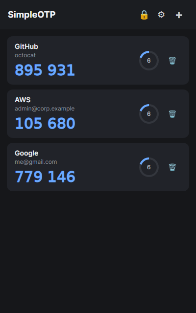
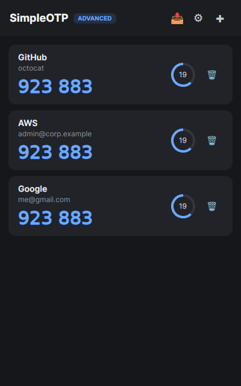
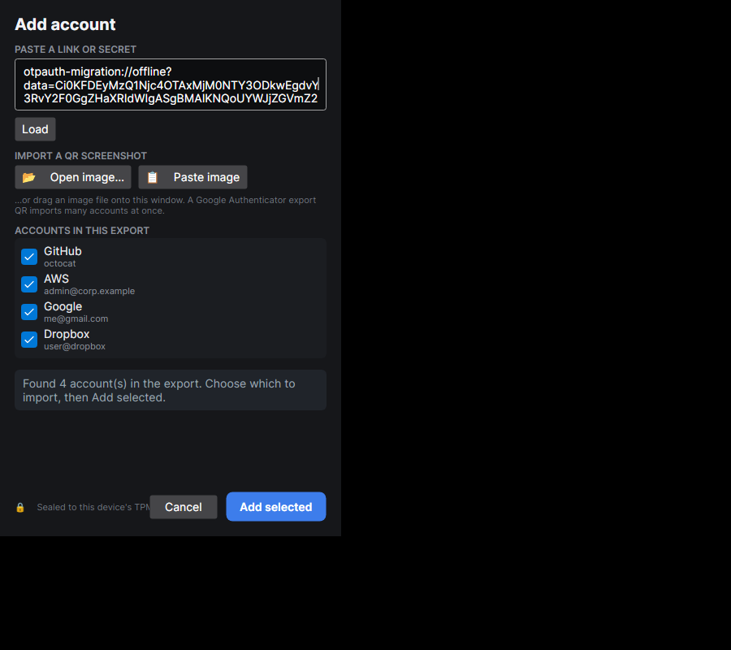
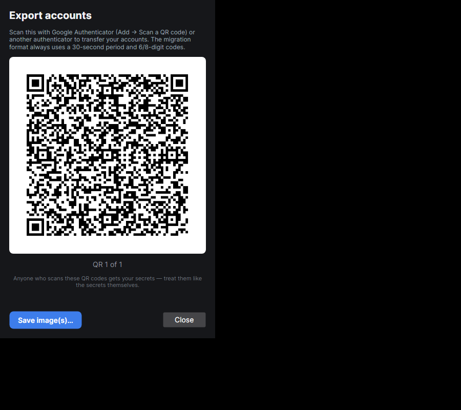
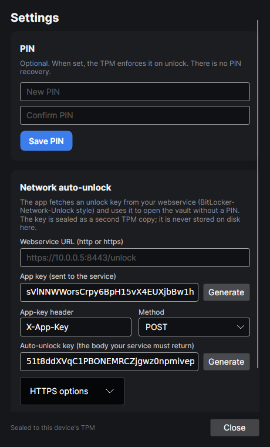

# SimpleOTP

A Windows-first desktop authenticator for TOTP codes, built with .NET 10 and Avalonia.

SimpleOTP gives you the familiar authenticator app flow - accounts, live countdowns, click-to-copy
codes - with a TPM-backed security model. The headline feature is **Advanced Security mode**:

2FA codes are stored and calculated entirely inside the TPM. This means that unlike with conventional tools like Bitwarden, an attacker could only ever extract the current 2FA code, but never any future codes without continued access to the device.



## Highlights

- **Snipping Tool-first QR import** - click **Snip...**, capture the QR, and import automatically.
- **Advanced Security mode** - the cryptographic showcase: non-exportable TPM-backed OTP secrets.
- **Simple Security mode** - fast TPM-sealed vault encryption with the same PIN and auto-unlock
  options.
- **Google Authenticator migration** - import/export bulk `otpauth-migration://` QR codes, including
  multi-QR exports.
- **Desktop-native authenticator UX** - live countdown rings, click-to-copy codes, lock/unlock, and
  quick account management.
- **Device-bound by default** - copying `vault.json` to another computer does not make the secrets
  usable there.
- **No insecure fallback** - if a TPM 2.0 device is not available, the app refuses to store secrets.

## Download & Install

Grab the latest build for your platform from the
[Releases page](https://github.com/permissionBRICK/SimpleOTP/releases).

**Windows**

- **Installer** — `SimpleOTP-Setup-<version>-win-x64.exe` (or `-win-arm64`). Choose a per-user or
  all-users install and the location; it checks for the .NET 10 runtime and downloads it if missing,
  and adds Start-menu / desktop shortcuts.
- **Portable** — `SimpleOTP-<version>-win-x64-portable.zip` (or `-win-arm64`). Self-contained: unzip
  into a folder and run `SimpleOtp.exe`; no install or runtime needed.

**Linux**

- **Debian/Ubuntu** — `sudo apt install ./simpleotp_<version>_amd64.deb` (or `_arm64`).
- **Fedora/RHEL** — `sudo dnf install ./simpleotp-<version>-1.x86_64.rpm` (or `.aarch64`).
- **Any distro** — extract `SimpleOTP-<version>-linux-x64.tar.gz` (or `-linux-arm64`) and run
  `SimpleOTP/install.sh`. It picks a per-user (`~/.local`) or system (`/opt`, with `sudo`) install,
  installs the .NET 10 runtime if missing, and adds a desktop launcher; `uninstall.sh` reverses it.

Secrets are sealed to your machine's TPM, so a vault copied from another machine will not open — install
fresh and re-add your accounts there.

## Updating

On startup SimpleOTP checks GitHub for a newer release. When one is found it shows a popup with
**Update** / **Ignore**:

- **Update** downloads the package matching how you installed it and applies it in one click, then
  restarts the app (on Windows the installer re-runs silently; on Linux the script swaps files or runs
  your package manager via a graphical prompt).
- **Ignore** hides the popup for that version and shows a small **update** indicator in the title bar
  instead — click it any time to update. A strictly newer release will prompt again.

Turn the automatic check off in **Settings -> Software updates** (or untick it during the Windows
install). With it off, update yourself from the **Open releases page** button or the
[Releases page](https://github.com/permissionBRICK/SimpleOTP/releases).

## Security Modes

Choose the mode in **Settings -> Security mode**.

| Mode | Best for | What you get |
|---|---|---|
| **Advanced Security** | Maximum seed isolation | Non-exportable TPM-held OTP secrets, TPM HMAC generation, optional PIN, optional auto-unlock, optional export recovery |
| **Simple Security** | Fast everyday use | AES-256-GCM encrypted vault under a TPM-sealed key, optional PIN, optional auto-unlock, free export |

Advanced mode is the star of the project. Simple mode is the practical default for users who want
TPM device binding plus simpler export workflows.



## Requirements

**To run** (end users):

- A **TPM 2.0** device — Windows: TBS · Linux: `/dev/tpmrm0`. Required by **every** build, including the
  portable zip.
- The **.NET 10 Runtime** (`Microsoft.NETCore.App`). The Windows installer and the Linux `install.sh`
  install it for you if it is missing; the `.deb`/`.rpm` packages **recommend** it (a soft dependency)
  and the post-install step warns with the exact install command if it is absent. The portable Windows
  zip is self-contained, so it needs no separate runtime — but it still needs the TPM.

**To build**: the **.NET 10 SDK**.

## Build & Run

```bash
dotnet build
dotnet test
dotnet run --project src/SimpleOtp.App
```

Release builds are **framework-dependent** (smaller, faster startup; the runtime is installed
separately). Publish for a specific runtime:

```bash
dotnet publish src/SimpleOtp.App -c Release -r linux-x64 --no-self-contained -p:PublishReadyToRun=true
```

Swap `-r` for `win-x64`, `win-arm64`, or `linux-arm64`. Do **not** use `PublishTrimmed` — Avalonia view
location relies on reflection. (The portable Windows zip is the exception: it is built `--self-contained`
so it runs without the runtime.)

Installers and packages are produced automatically by CI (see [Releasing](#releasing--versioning-maintainers)).
To build them locally, see [installer/README.md](installer/README.md) (Windows) and
[packaging/linux/](packaging/linux/) (Linux).

## Import Accounts

Open **Add account** with the **+** button.

- **Snip a QR**: click **Snip...**, capture the QR with Windows Snipping Tool, and let SimpleOTP
  import it from the clipboard.
- **Paste a QR screenshot**: capture with `Win` + `Shift` + `S`, then use **Paste image**.
- **Open or drop a QR image**: use **Open image...**, paste from the clipboard, or drag an image
  file onto the window.
- **Import Google Authenticator bulk exports**: load one or more `otpauth-migration://` QR codes and
  choose which TOTP accounts to add.
- **Paste account text**: use an `otpauth://totp/...` URI or raw Base32 secret.
- **Enter manually**: issuer, label, secret, algorithm, digits, and period.



## Everyday Use

- Click a code card to copy the current OTP.
- Use **Export** to generate Google Authenticator-compatible migration QR codes.
- Use **Settings** to change security mode, configure a PIN, or set up network auto-unlock.
- Use **Lock** to clear unlocked key material from memory until the vault is opened again.



## Security Details

### Why The TPM Matters

SimpleOTP was inspired by [`mtausig/totpm`](https://gitlab.com/mtausig/totpm), a Go CLI that imports
TOTP seeds into a TPM. SimpleOTP keeps that device-binding idea and adds a desktop UI, modern import
and export flows, multiple algorithms, and two security modes.

| | `totpm` | **SimpleOTP** |
|---|---|---|
| Secret protection | Seed imported into TPM as an HMAC key | Advanced TPM HMAC keys or Simple TPM-sealed vault encryption |
| Local auth | None | Optional TPM PIN and network auto-unlock; optional export password in Advanced mode |
| Algorithms | SHA1 only | SHA1, SHA256, SHA512 |
| Interface | CLI | Avalonia desktop app |
| TPM persistence | Transient | Transient; no TPM NV storage |

### Simple Security Details

Simple mode stores each OTP seed as AES-256-GCM ciphertext under a random data-encryption key. That
key is sealed by the TPM and can optionally require a PIN.

On launch, the TPM unseals the vault key only on the machine that created it. With a PIN enabled,
wrong attempts feed the TPM dictionary-attack lockout, so brute force is throttled by hardware.
There is no PIN recovery.

### Advanced Security Details

Advanced mode imports each seed into the TPM as a non-exportable keyed-hash object with `FixedTPM`
and `FixedParent`. TOTP HMAC calculation happens in the chip, so routine code generation does not
need the seed to leave the TPM.

PIN and network auto-unlock still work in Advanced mode. They gate the vault key that authorizes the
per-account TPM HMAC keys.

Export is the deliberate trade-off:

- Set a **master password** to keep an encrypted recovery copy for exports and conversion back to
  Simple mode.
- Skip the password to make imported seeds permanently non-exportable. Keep your original QR codes
  and recovery codes.

Some firmware TPMs support SHA1/SHA256 keyed-hash keys but not SHA512. SHA512 accounts stay in
Simple mode on those chips and the app shows a clear message.

Advanced vaults may take longer to open or refresh when they contain many accounts because each code
generation path uses the TPM.

### Device-Binding Caveat

There is no cloud backup or escrow. If the TPM is cleared, reset, or replaced, TPM-bound secrets are
not recoverable from the vault file alone. Keep recovery codes for every account.

## Network Auto-Unlock

Both security modes can unlock from a local or LAN service instead of asking for your PIN every session. The
feature is inspired by BitLocker Network Unlock, but SimpleOTP is only the client.

Configure it in **Settings -> Network auto-unlock**.

| | |
|---|---|
| Request | `POST {url}` or `GET {url}` with `X-App-Key: {appKey}` |
| Success | `200 OK` with the auto-unlock key as the UTF-8 response body |
| Failure | Any non-2xx response, invalid response, or unreachable service falls back to PIN unlock |

The auto-unlock key is not stored by SimpleOTP. The vault stores only endpoint settings and a second
TPM-sealed blob. A copied vault plus app key still cannot unlock on another machine without the
matching TPM.



## Data & Storage

Vault file permissions are restricted to the current user.

- Windows: `%AppData%\SimpleOtp\vault.json`
- Linux/macOS: `~/.config/SimpleOtp/vault.json`

Simple mode account shape:

```jsonc
{
  "Version": 2,
  "Backend": "tpm2",
  "Mode": "Simple",
  "PinProtected": false,
  "Dek": { "Public": "<base64 TPM2B public>", "Private": "<base64 TPM2B private>" },
  "DekAuto": { "Public": "...", "Private": "..." },
  "AutoUnlock": { "Enabled": true, "Url": "https://.../unlock", "AppKey": "...", "Method": "POST" },
  "Accounts": [
    {
      "Id": "...",
      "Issuer": "GitHub",
      "Label": "octocat",
      "Algorithm": "Sha1",
      "Digits": 6,
      "Period": 30,
      "Secret": { "Nonce": "...", "Tag": "...", "Ciphertext": "..." }
    }
  ]
}
```

Advanced mode adds TPM object blobs for non-exportable account keys and, only when enabled, encrypted
export recovery material.

## Releasing & Versioning (maintainers)

Pushing to `master` triggers [`.github/workflows/release.yml`](.github/workflows/release.yml), which
builds every artifact (Windows installer + portable zip; Linux `.tar.gz`, `.deb`, `.rpm`; for x64 and
arm64) and publishes a GitHub release.

Versions are `MAJOR.MINOR.PATCH`:

- `MAJOR.MINOR` live in [`version.json`](version.json). Change them with `scripts/set-version.sh 1.2`
  (or `scripts/set-version.ps1 1.2`), then commit and push.
- `PATCH` auto-increments: CI counts the existing `v<major>.<minor>.*` tags, so each push to `master`
  cuts the next patch and bumping major/minor restarts patch at `0`.

[`.github/workflows/ci.yml`](.github/workflows/ci.yml) builds and tests pull requests and feature branches.

**Optional VirusTotal scan.** Set a `VIRUSTOTAL_API_KEY` repository secret and the release job submits the
Windows installers and portable zips to VirusTotal and links the scan reports in the release notes. It is
skipped when the secret is absent and never fails the release. This is for transparency and early
false-positive detection — it does **not** remove antivirus false positives (code signing plus per-vendor
false-positive reports do that).

## Project Layout

```text
SimpleOtp.slnx
|-- version.json            MAJOR.MINOR release line (CI computes PATCH)
|-- src/
|   |-- SimpleOtp.Core/     TOTP engine, otpauth parser, vault, store, auto-unlock, update checker
|   |-- SimpleOtp.Tpm/      TPM 2.0 sealer implementation over Microsoft.TSS
|   |-- SimpleOtp.Import/   QR decoding and encoding
|   `-- SimpleOtp.App/      Avalonia 12 GUI (incl. update service + UI)
|-- tests/
|   `-- SimpleOtp.Tests/    xUnit tests for TOTP, parsing, vaults, QR, security modes, updates, view models
|-- installer/             Inno Setup Windows installer
|-- packaging/linux/       nfpm .deb/.rpm config + tar.gz install scripts
|-- scripts/               set-version helpers
`-- .github/workflows/     ci + auto-release
```

The TPM implementation sits behind `ISecretSealer`, so the core logic stays unit-testable with an
in-memory fake.

## Real-TPM Tests

TPM integration tests are skipped by default.

```bash
SIMPLEOTP_TPM_TEST=1 dotnet test --filter FullyQualifiedName~TpmIntegrationTests
```

The dictionary-attack test deliberately fails one auth attempt, so it needs a second opt-in:

```bash
SIMPLEOTP_TPM_TEST=1 SIMPLEOTP_TPM_DA_TEST=1 dotnet test --filter FullyQualifiedName~TpmIntegrationTests
```

## Key Dependencies

`Microsoft.TSS` for TPM 2.0, `Otp.NET` for RFC 6238, `ZXing.Net` and SkiaSharp for QR handling,
Avalonia 12 and CommunityToolkit.Mvvm for the desktop app.
